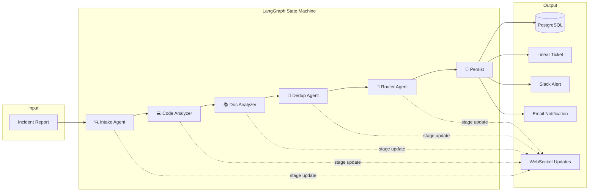

# AGENTS_USE.md — Multi-Agent Pipeline Deep Dive

Trinity uses a **5-agent sequential pipeline** orchestrated by [LangGraph](https://github.com/langchain-ai/langgraph). Each agent is a specialized function that reads from and writes to a shared state dictionary, progressively enriching the incident with structured analysis.

---

## Pipeline Architecture



**Why Sequential?** LangGraph supports parallel fan-out, but we use sequential execution for reliability. Each agent's output feeds the next — the Code Analyzer needs the Intake's `affected_service` to search the right code, and the Router needs all previous outputs to make the final severity decision.

---

## Agent Detail: 1 — Intake Agent

**File:** `backend/app/agents/intake_agent.py` (234 lines)
**Model:** `gemini-3.1-flash-lite-preview`
**Purpose:** Extract structured, machine-readable data from raw human-written incident reports.

### Input
| Field | Type | Source |
|---|---|---|
| `raw_title` | `str` | Reporter form |
| `raw_description` | `str` | Reporter form |
| `attachments` | `list[dict]` | Uploaded files |

### Output
| Field | Type | Example |
|---|---|---|
| `structured_title` | `str` | `"Payment gateway timeout on Stripe charge"` |
| `affected_service` | `enum` | `checkout`, `payment`, `order`, `product`, `graphql`, `infrastructure` |
| `error_type` | `enum` | `500_error`, `timeout`, `payment_error`, `stock_error`, ... |
| `severity_hint` | `str` | `P1`, `P2`, `P3`, `P4` |
| `extracted_error_codes` | `list[str]` | `["INSUFFICIENT_STOCK", "HTTP 500"]` |
| `keywords` | `list[str]` | `["checkout", "total_gross_amount", "TypeError"]` |

### Key Features
- **Multimodal Analysis**: If the reporter uploads a screenshot, the agent uses Gemini's vision capabilities to read error messages, stack traces, and UI state directly from the image.
- **Guardrails Integration**: Runs prompt injection detection and PII scrubbing before sending to the LLM.
- **Heuristic Fallback**: If the Gemini API fails, a keyword-based fallback extracts service, error type, and severity using pattern matching.
- **Structured JSON Output**: Uses `response_mime_type="application/json"` to enforce structured output from Gemini.

### Prompt Design
The system prompt defines an exhaustive enum for every field — the LLM maps free-form text to a fixed taxonomy. Temperature is set to 0.1 for consistency.

---

## Agent Detail: 2 — Code Analyzer

**File:** `backend/app/agents/code_analyzer.py` (150 lines)
**Model:** `gemini-3.1-flash-lite-preview` + ChromaDB RAG
**Purpose:** Search the Saleor e-commerce codebase to find files related to the incident and hypothesize root causes.

### RAG Strategy
1. Build multiple search queries from the Intake's output: `"{service} {error_type}"`, `"{keywords}"`, `"{title}"`
2. Run each query against ChromaDB (Saleor codebase collection)
3. Deduplicate results by file path
4. Feed top 8 code snippets (1500 chars each) to Gemini

### Output
| Field | Type | Example |
|---|---|---|
| `related_code_files` | `list[str]` | `["saleor/payment/gateway.py", "saleor/checkout/complete.py"]` |
| `code_root_cause` | `str` | `"Race condition in checkout completion — total_gross_amount accessed before payment capture callback"` |
| `code_confidence` | `float` | `0.85` |

### Indexed Codebase
The RAG indexer processes the Saleor subset at startup:
- `saleor/checkout/` — Checkout flow, line items, completion
- `saleor/payment/` — Payment gateway, Stripe integration, error codes
- `saleor/order/` — Order processing, fulfillment, cancellation
- `saleor/product/` — Product catalog, stock management
- `saleor/graphql/` — API layer
- `saleor/docs/` — Architecture docs, common errors, runbooks

---

## Agent Detail: 3 — Doc Analyzer

**File:** `backend/app/agents/doc_analyzer.py` (150 lines)
**Model:** `gemini-3.1-flash-lite-preview` + ChromaDB RAG
**Purpose:** Search documentation and runbooks to find known issues and remediation steps.

### RAG Strategy
Similar to Code Analyzer but searches a separate ChromaDB collection (`saleor_docs`) containing:
- Architecture documentation
- Common error reference guides
- Runbook-style troubleshooting steps
- Historical incident notes

### Output
| Field | Type | Example |
|---|---|---|
| `suggested_runbook` | `str` | `"1. Check Stripe webhook logs\n2. Verify idempotency key..."` |
| `known_issues` | `list[str]` | `["Stripe timeout during peak hours (ISSUE-2847)"]` |
| `doc_references` | `list[str]` | `["docs/common_errors.md", "docs/runbooks/payment_failures.md"]` |
| `estimated_resolution_time` | `str` | `"15-30 minutes"` |

---

## Agent Detail: 4 — Dedup Agent

**File:** `backend/app/agents/dedup_agent.py` (146 lines)
**Model:** ChromaDB embedding similarity (no LLM call)
**Purpose:** Detect duplicate or related incidents to prevent ticket storms.

### Algorithm
1. Compose incident text: `"[{service}] {title}: {description}"`
2. Query ChromaDB `triageforge_incidents` collection for similar vectors
3. Convert L2 distance to similarity score: `similarity = 1 - (distance / 2)`
4. Classify:
   - **Duplicate:** similarity ≥ 0.85 with an open incident → link to parent
   - **Related:** similarity 0.70–0.85 → list as related
   - **Unique:** similarity < 0.70
5. Add current incident to the collection for future comparisons

### Output
| Field | Type | Example |
|---|---|---|
| `is_duplicate` | `bool` | `false` |
| `duplicate_of_id` | `str?` | `null` or `"abc-123"` |
| `related_incidents` | `list[dict]` | `[{"incident_id": "...", "similarity": 0.78}]` |

### Key Design Decision
No LLM call — embedding similarity is faster, cheaper, and more deterministic than asking an LLM "is this a duplicate?" The thresholds (0.85/0.70) were tuned against test data.

---

## Agent Detail: 5 — Router Agent

**File:** `backend/app/agents/router_agent.py` (199 lines)
**Model:** `gemini-3.1-flash-lite-preview`
**Purpose:** Final decision-maker — assigns severity, routes to team, plans notifications.

### Decision Inputs
The Router sees **everything** from prior agents:
- Intake: service, error type, severity hint
- Code Analyzer: root cause hypothesis, confidence score
- Doc Analyzer: known issues, runbook match quality
- Dedup: duplicate status, related incidents

### Team Routing (Rule-Based)
```
checkout/payment  → platform-payments
order             → order-fulfillment
product           → catalog-team
graphql           → api-platform
infrastructure    → sre-infra
unknown           → sre-oncall
```

### Notification Strategy (Severity-Based)
| Severity | Channels | Recipients |
|---|---|---|
| **P1** | Slack + Email | `#critical-incidents`, oncall + SRE leads |
| **P2** | Slack + Email | `#incidents`, oncall |
| **P3** | Slack only | `#incidents` |
| **P4** | None | (logged only) |

All severities also send a **confirmation email** to the reporter.

### Output
| Field | Type | Example |
|---|---|---|
| `final_severity` | `str` | `"P1"` |
| `assigned_team` | `str` | `"platform-payments"` |
| `triage_summary` | `str` | `"Critical: Payment gateway timeout affecting all Stripe charges..."` |
| `recommended_actions` | `list[str]` | `["Check Stripe dashboard", "Roll back deploy #4523"]` |
| `notification_plan` | `list[dict]` | Channel/recipient/urgency tuples |

---

## Shared State: `TriageState`

All agents read from and write to a single `TypedDict`:

```python
class TriageState(TypedDict, total=False):
    # --- Input ---
    incident_id: str
    raw_title: str
    raw_description: str
    reporter_name: str
    reporter_email: str
    attachments: list

    # --- Intake output ---
    structured_title: str
    affected_service: str
    error_type: str
    severity_hint: str
    keywords: list
    extracted_error_codes: list

    # --- Code Analyzer output ---
    related_code_files: list
    code_root_cause: str
    code_confidence: float

    # --- Doc Analyzer output ---
    suggested_runbook: str
    known_issues: list
    doc_references: list

    # --- Dedup output ---
    is_duplicate: bool
    duplicate_of_id: Optional[str]
    related_incidents: list

    # --- Router output ---
    final_severity: str
    assigned_team: str
    triage_summary: str
    recommended_actions: list
    notification_plan: list

    # --- Pipeline metadata ---
    pipeline_stages: list
    errors: list
    pipeline_start_time: str
    pipeline_end_time: str
```

---

## Real-Time Stage Updates

Each agent node broadcasts WebSocket updates as it executes:

```json
{
  "type": "stage_update",
  "incident_id": "abc-123",
  "stage": "code_analysis",
  "status": "completed",
  "message": "Found 4 relevant files",
  "timestamp": "2026-04-09T12:00:05Z"
}
```

The frontend renders these as an animated pipeline visualization — each node pulses when running, glows when complete, and shows the message below.

---

## Error Handling

Every agent is wrapped in a `try/except` with:
1. **Span attribute**: `error=True`, `error.message=str(e)` for Tempo visibility
2. **Metric**: Stage duration still recorded (captures failure timing)
3. **Fallback values**: Each agent sets sensible defaults so the pipeline continues
4. **Error accumulation**: Errors append to `state["errors"]` instead of crashing

The pipeline **never stops** on a single agent failure — it degrades gracefully.

---

## Observability per Agent

Each agent stage is wrapped with:
- **OTel Span**: `tracer.start_as_current_span("pipeline.{stage}")`
- **Prometheus Timer**: `stage_timer("{stage}")` records duration histogram
- **Structured Logs**: JSON logs with `trace_id` for Loki → Tempo linking

Access the full trace in Grafana → Explore → Tempo → search for `triageforge-backend`.
