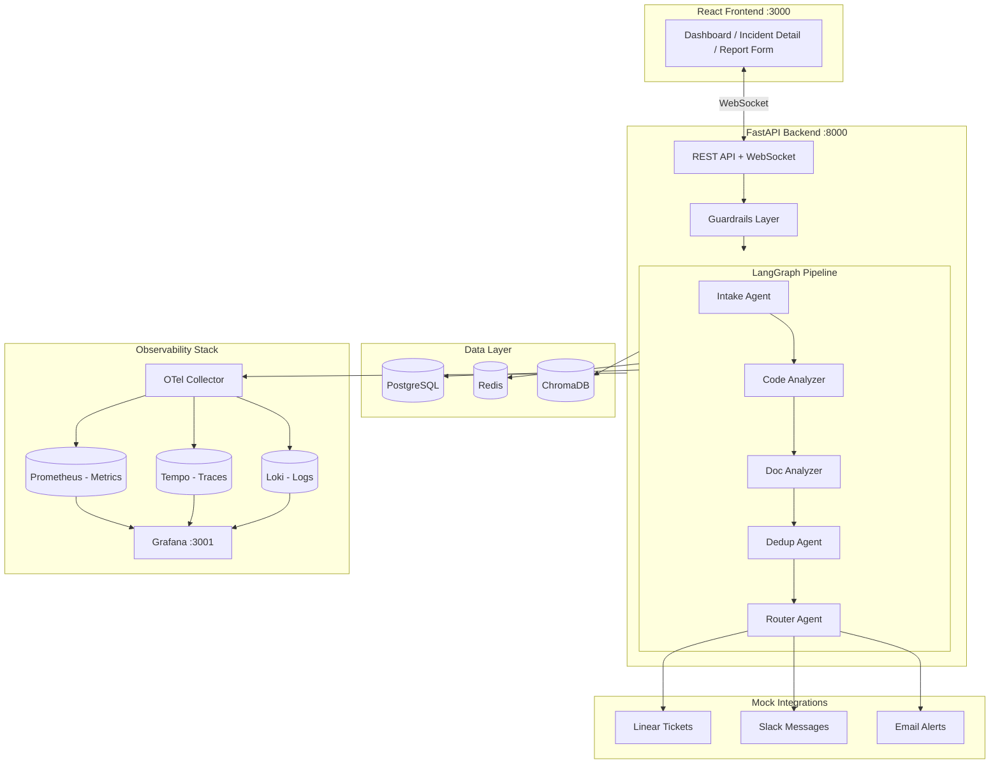
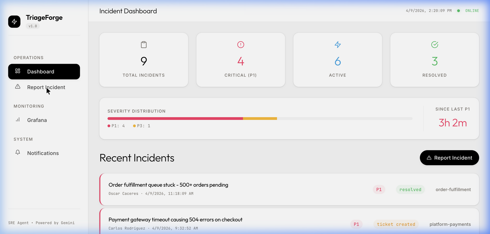
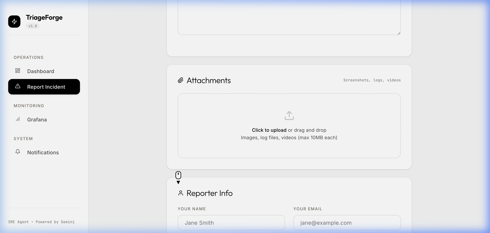
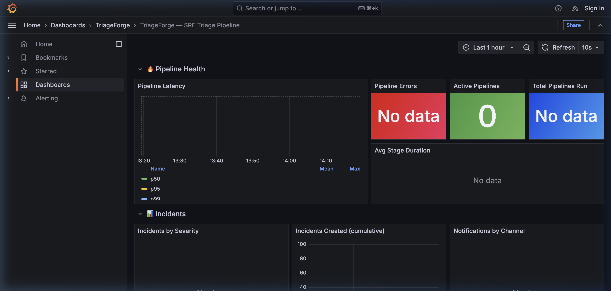
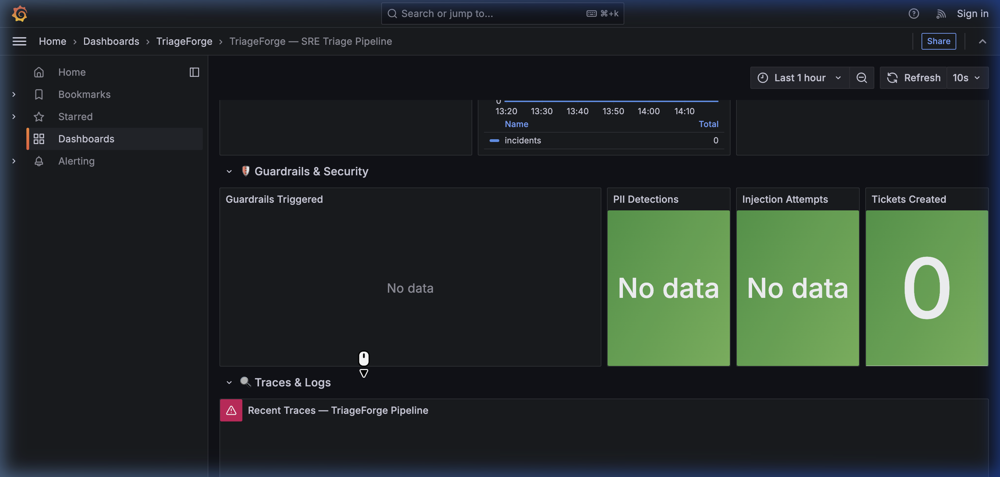

# TriageForge

**AI-Powered SRE Incident Triage Agent** — Code-aware, real-time, fully observable.


---

## The Problem

Manual incident triage is slow, inconsistent, and doesn't scale. When a P1 fires at 3 AM, oncall engineers spend 10–30 minutes gathering context before they can even begin fixing things — identifying affected services, searching for related code, checking if it's a known issue, and routing to the right team.

**TriageForge automates this entire workflow in under 60 seconds.**

---

## What TriageForge Does

A 5-agent AI pipeline analyzes every incoming incident in real-time:

| # | Agent | What It Does |
|---|---|---|
| 1 | **Intake** | Extracts structured data from raw reports — service, severity, error codes. Supports **screenshot analysis** via Gemini multimodal. |
| 2 | **Code Analyzer** | RAG search over the **Saleor e-commerce codebase** — finds root cause hypotheses with confidence scores. |
| 3 | **Doc Analyzer** | RAG search over **runbooks and documentation** — surfaces known issues and step-by-step remediation. |
| 4 | **Dedup** | Embedding-based **duplicate detection** via ChromaDB — prevents ticket storms. |
| 5 | **Router** | Synthesizes all signals → assigns **final severity (P1–P4)**, routes to the right team, plans notifications. |

### 🔥 Wow Factors

- **Code-Aware Triage** — The only system that searches the actual codebase to find root causes
- **Visual Analysis** — Upload a screenshot and the AI reads error messages, stack traces, and UI state
- **Real-Time Pipeline Animation** — Watch each agent stage light up via WebSocket as triage happens
- **Full Observability** — Pre-built Grafana dashboard with latency histograms, guardrail counters, and Tempo traces
- **Production Guardrails** — Prompt injection detection, PII scrubbing, and file validation wired into every request

---

## Architecture



---

## Screenshots

### Incident Dashboard
Real-time severity distribution, P1 timer, WebSocket-powered live updates.



### Incident Report Form
Character count, image thumbnail previews, animated success card.



### Grafana Observability Dashboard
14-panel pre-provisioned dashboard — pipeline latency, severity distribution, guardrails activity.





---

## Tech Stack

| Layer | Technology | Purpose |
|---|---|---|
| **LLM** | Gemini 3.1 Flash Lite | All 5 agents — structured JSON output |
| **Agent Framework** | LangGraph | Multi-agent state machine orchestration |
| **Backend** | FastAPI + Uvicorn | Async REST API + WebSocket |
| **Frontend** | React 18 + Vite | ElevenLabs-inspired premium UI |
| **Database** | PostgreSQL 16 | Incidents, tickets, notifications |
| **Vector DB** | ChromaDB | RAG embeddings + dedup similarity |
| **Cache** | Redis 7 | Session cache + future job queue |
| **Tracing** | OpenTelemetry → Tempo | Distributed traces with span-level detail |
| **Logging** | Structured JSON → Loki | Trace-correlated logs |
| **Metrics** | prometheus_client → Prometheus | Custom counters, histograms, gauges |
| **Dashboards** | Grafana 11 | Pre-provisioned 14-panel dashboard |
| **Container** | Docker Compose | 10 services, single `docker compose up` |

---

## Quick Start

```bash
# 1. Clone
git clone <repo-url> && cd triageforge

# 2. Configure
cp .env.example .env
# Edit .env → paste your GOOGLE_API_KEY

# 3. Run
docker compose up --build -d

# 4. Wait ~2 minutes for first build + RAG indexing
```

| Service | URL |
|---|---|
| **Frontend** | http://localhost:3000 |
| **Backend API** | http://localhost:8000 |
| **API Docs (Swagger)** | http://localhost:8000/docs |
| **Grafana** | http://localhost:3001 |
| **Prometheus** | http://localhost:9090 |

> See [QUICKGUIDE.md](QUICKGUIDE.md) for the full 60-second setup.

---

## Project Structure

```
triageforge/
├── backend/
│   ├── app/
│   │   ├── agents/              # 5 LangGraph agents
│   │   │   ├── pipeline.py      # LangGraph state machine
│   │   │   ├── intake_agent.py  # Multimodal intake
│   │   │   ├── code_analyzer.py # RAG code search
│   │   │   ├── doc_analyzer.py  # RAG doc search
│   │   │   ├── dedup_agent.py   # Embedding dedup
│   │   │   └── router_agent.py  # Severity + routing
│   │   ├── api/                 # REST + WebSocket endpoints
│   │   ├── guardrails/          # Injection, PII, validation
│   │   ├── integrations/        # Mock Linear, Slack, Email
│   │   ├── observability/       # Tracing, metrics, structured logging
│   │   ├── rag/                 # ChromaDB indexer + retriever
│   │   ├── models.py            # SQLAlchemy models
│   │   └── main.py              # FastAPI app + OTel setup
│   ├── ecommerce_codebase/      # Saleor subset (indexed by RAG)
│   ├── Dockerfile
│   └── requirements.txt
├── frontend/
│   ├── src/
│   │   ├── components/          # Dashboard, IncidentDetail, Form, Feed
│   │   ├── utils/api.js         # REST + WebSocket client
│   │   └── index.css            # ElevenLabs design system
│   └── Dockerfile
├── observability/
│   ├── grafana/provisioning/    # Datasources + dashboards
│   ├── otel-collector-config.yaml
│   └── prometheus.yml
├── docker-compose.yml           # 10 services
├── .env.example
└── DESIGN.md                    # Frontend design system reference
```

---

## API Reference

| Method | Endpoint | Description |
|---|---|---|
| `POST` | `/api/incidents` | Submit new incident (multipart/form-data) |
| `GET` | `/api/incidents` | List all incidents |
| `GET` | `/api/incidents/{id}` | Get incident details + triage report |
| `PATCH` | `/api/incidents/{id}` | Update incident (resolve, reassign) |
| `GET` | `/api/incidents/{id}/pipeline-status` | Pipeline execution status |
| `WS` | `/api/incidents/ws/{id}` | Real-time pipeline updates |
| `WS` | `/api/incidents/ws` | Global dashboard updates |
| `GET` | `/api/tickets` | List all generated tickets |
| `GET` | `/api/notifications` | List all sent notifications |
| `GET` | `/health` | Health check |
| `GET` | `/metrics` | Prometheus metrics |

---

## Observability

TriageForge ships with a **full observability stack** — zero configuration needed:

### Custom Metrics (Prometheus)
- `triageforge_pipeline_duration_seconds` — End-to-end latency histogram
- `triageforge_pipeline_stage_duration_seconds` — Per-agent stage timing
- `triageforge_incidents_by_severity_total` — P1/P2/P3/P4 distribution
- `triageforge_guardrails_triggered_total` — Injection/PII/validation counters
- `triageforge_notifications_sent_total` — Slack/Email delivery counts

### Custom Spans (Tempo)
Every pipeline stage creates a named span with contextual attributes:
`pipeline.full_run` → `pipeline.intake` → `pipeline.code_analysis` → `pipeline.doc_analysis` → `pipeline.dedup` → `pipeline.router` → `pipeline.persist`

### Structured Logs (Loki)
JSON-formatted logs with `trace_id` and `span_id` — click a log to jump to its trace.

---

## Guardrails

| Guardrail | What It Does | Trigger |
|---|---|---|
| **Prompt Injection** | Detects `ignore previous`, `system:`, jailbreak patterns | Sanitizes input before LLM |
| **PII Scrubbing** | Removes SSNs, credit cards, API keys, emails | Scrubs before pipeline |
| **Input Validation** | File type allowlist, size limits (10MB) | Rejects invalid attachments |

All triggers are recorded in Prometheus metrics and included in the triage report.

---

## Documentation

- [AGENTS_USE.md](AGENTS_USE.md) — Deep-dive into the multi-agent pipeline
- [SCALING.md](SCALING.md) — Production scaling strategy
- [QUICKGUIDE.md](QUICKGUIDE.md) — 60-second setup guide
- [DESIGN.md](DESIGN.md) — Frontend design system (ElevenLabs-inspired)
- [DEMO_SCRIPT.md](DEMO_SCRIPT.md) — 3-minute demo recording guide

---

## Hackathon Context

**SoftServe AI Hackathon 2026** — Solo developer, built in ~24 hours.

The challenge: Build an AI agent for enterprise use. TriageForge targets **SRE incident management** — a domain where seconds matter, context is scattered, and human triage is the bottleneck.

Key differentiators:
- **Not just a chatbot** — a full multi-agent pipeline with specialized roles
- **Not just text** — multimodal analysis (screenshots, error images)
- **Not just AI** — production-grade observability, guardrails, and integration layer
- **Not just a demo** — containerized, documented, deployable
