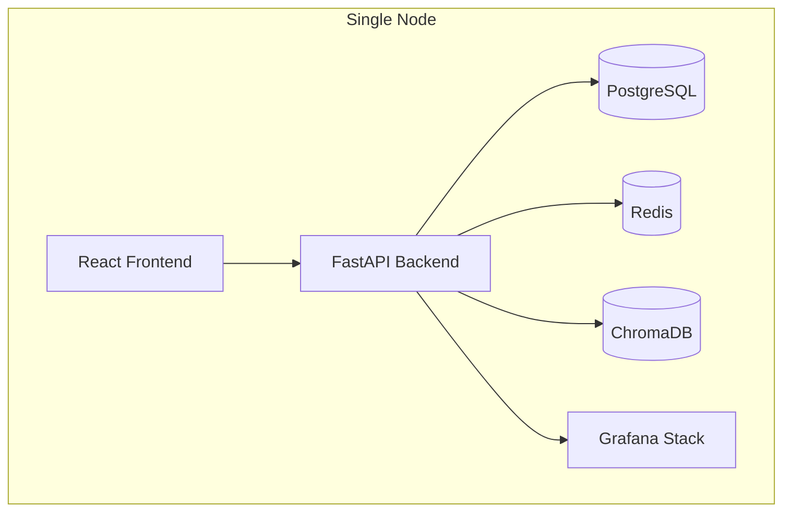
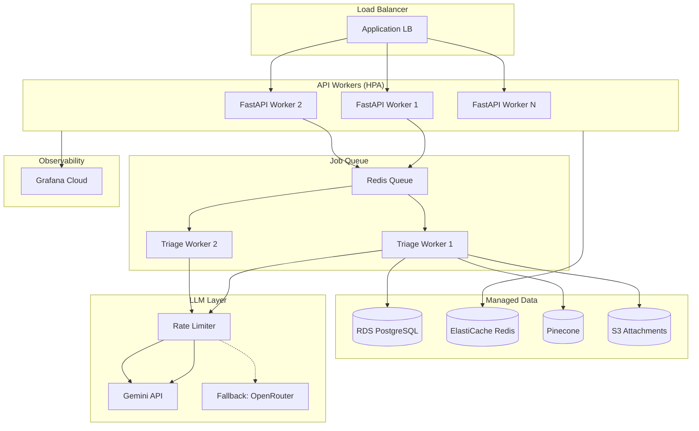

# SCALING.md — Production Scaling Strategy

Trinity is designed as a **single-node Docker Compose deployment** for the hackathon. This document outlines the path to production scale.

---

## Current Architecture



**Capacity**: ~10 concurrent incidents, ~100 incidents/hour on a single 4-core machine.

**Bottleneck**: The LLM API — each agent makes a Gemini call, so a pipeline run makes 4 calls sequentially (Dedup is embedding-only). At ~2s per call, pipeline latency is ~8–15 seconds.

---

## Scaling Dimensions

| Dimension | Current (Demo) | Production | Migration Path |
|---|---|---|---|
| **API Servers** | 1 Uvicorn worker | N workers behind LB | Gunicorn + K8s HPA |
| **Pipeline Execution** | In-process `asyncio.create_task` | Distributed job queue | Celery/ARQ + Redis broker |
| **Vector DB** | ChromaDB (single node, in-memory) | Pinecone / Weaviate (managed) | Swap retriever adapter |
| **Database** | PostgreSQL (single) | RDS/CloudSQL + read replicas | Connection pooling (PgBouncer) |
| **Observability** | Self-hosted Grafana stack | Grafana Cloud / Datadog | OTel collector config swap |
| **LLM** | Single API key, no rate limiting | Key rotation + token bucket | Redis-based rate limiter |
| **File Storage** | Local Docker volume | S3 / GCS | Environment variable swap |
| **Caching** | None | Redis cache for RAG + dedup | Cache layer in retriever |

---

## Production Architecture



---

## Key Scaling Strategies

### 1. Queue-Based Pipeline Execution

Currently, `create_incident` fires the pipeline as an `asyncio.create_task` — this ties the pipeline to the API process. In production:

```python
# Current (demo)
asyncio.create_task(_run_pipeline_and_persist(incident_id, ...))

# Production
celery_app.send_task("triage.run_pipeline", args=[incident_id, ...])
```

Benefits:
- Pipeline failures don't crash the API
- Workers scale independently from the API
- Built-in retry with exponential backoff
- Pipeline execution survives API restarts

### 2. RAG Cache Layer

Every `search_code()` and `search_docs()` call hits ChromaDB. In production, add a Redis cache:

```python
async def search_code_cached(query: str, n_results: int = 5):
    cache_key = f"rag:code:{hashlib.md5(query.encode()).hexdigest()}"
    cached = await redis.get(cache_key)
    if cached:
        return json.loads(cached)
    results = await search_code(query, n_results)
    await redis.setex(cache_key, 3600, json.dumps(results))  # 1hr TTL
    return results
```

Expected hit rate: ~40-60% (similar incidents search for similar code).

### 3. LLM Rate Limiting

Token bucket per API key to stay within Gemini quotas:

```python
class TokenBucket:
    def __init__(self, rate: int = 60, capacity: int = 100):
        self.rate = rate       # tokens per minute
        self.capacity = capacity
        self.tokens = capacity
        self.last_refill = time.time()

    async def acquire(self):
        self._refill()
        if self.tokens >= 1:
            self.tokens -= 1
            return True
        return False  # → route to fallback (OpenRouter)
```

### 4. Multi-Tenant Design

Namespace isolation per e-commerce application:

```python
# Current: single Saleor codebase
CHROMA_COLLECTION = "saleor_code"

# Multi-tenant: per-app collections
CHROMA_COLLECTION = f"{tenant_id}_code"  # e.g., "acme_code"
```

Each tenant gets:
- Separate ChromaDB collection (RAG index)
- Separate incident dedup namespace
- Separate team routing rules
- Isolated Grafana dashboard (via folder + row-level security)

---

## Cost Estimation

Per-incident LLM cost (Gemini 3.1 Flash Lite):

| Agent | Input Tokens | Output Tokens | Cost |
|---|---|---|---|
| Intake | ~500 | ~200 | ~$0.0003 |
| Code Analyzer | ~3,000 (incl. RAG snippets) | ~300 | ~$0.0015 |
| Doc Analyzer | ~2,500 (incl. docs) | ~300 | ~$0.0013 |
| Router | ~1,000 | ~200 | ~$0.0005 |
| **Total per incident** | **~7,000** | **~1,000** | **~$0.004** |

At 1,000 incidents/day: **~$4/day** or **~$120/month** in LLM costs.

Infrastructure (AWS, modest scale):
- RDS `db.t4g.medium`: ~$70/month
- ElastiCache `cache.t4g.micro`: ~$15/month
- 2x `t3.medium` workers: ~$60/month
- Pinecone starter: ~$70/month
- **Total**: ~$335/month (including LLM)

---

## Migration Checklist

- [ ] Replace `asyncio.create_task` with Celery/ARQ task queue
- [ ] Swap ChromaDB → Pinecone (update `rag/retriever.py`)
- [ ] Add PgBouncer connection pooling
- [ ] Move file uploads to S3 (`boto3`)
- [ ] Add Redis cache layer to RAG searches
- [ ] Implement LLM rate limiter with fallback provider
- [ ] Configure Grafana Cloud OTel endpoint
- [ ] Add Kubernetes manifests (Deployment, Service, HPA)
- [ ] Set up CI/CD pipeline (GitHub Actions → ECR → EKS)
- [ ] Add health check endpoints for K8s probes
